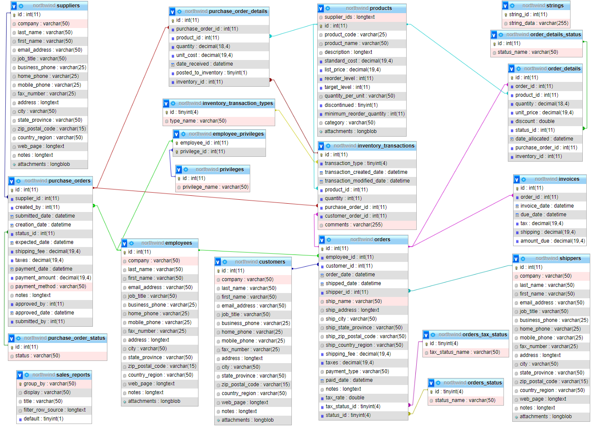

# Northwind Node.js Project

This project is a Node.js implementation of the Northwind database using Sequelize as the ORM. The project includes models for various tables such as orders, products, customers, and more.

## Project Setup

1. Clone the repository.
2. Run `npm install` to install the necessary dependencies.
3. Start the server using `npm start` or `nodemon`.

## Database Schema

Below is the schema of the Northwind database used in this project:

## Dependencies

- **Express**: A minimal and flexible Node.js web application framework.
- **Sequelize**: A promise-based Node.js ORM for Postgres, MySQL, MariaDB, SQLite, and Microsoft SQL Server.
- **MySQL2**: A MySQL client for Node.js with focus on performance.
- **Nodemon**: A tool that helps develop Node.js-based applications by automatically restarting the node application when file changes in the directory are detected.
- **CORS**: A Node.js package for providing a Connect/Express middleware that can be used to enable CORS with various options.

## License

This project is licensed under the ISC License.